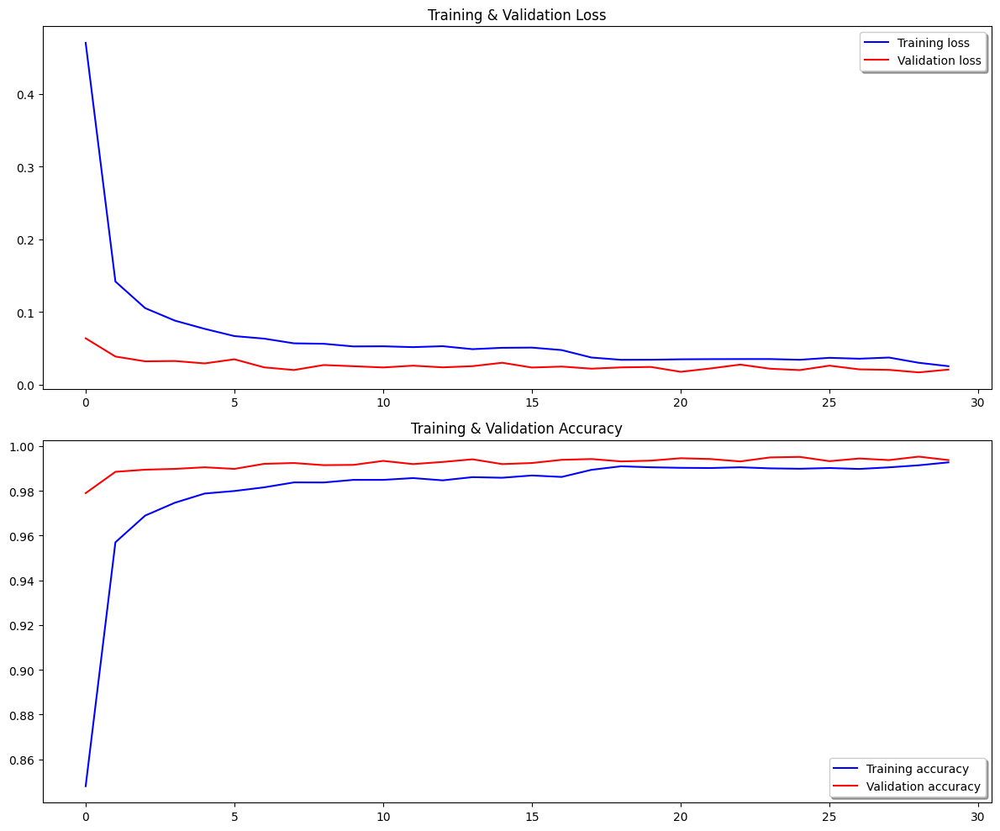
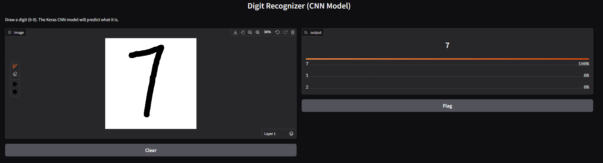

# Handwritten Digit Recognition using a Convolutional Neural Network (CNN)

This repository contains the code and resources for a machine learning project that classifies handwritten digits from the famous MNIST dataset. The project includes a Jupyter Notebook for training the model and generating a Kaggle submission, as well as a standalone Python application using Gradio for real-time, interactive testing.



## Table of Contents
- [Project Overview](#project-overview)
- [Dataset](#dataset)
- [Technologies & Libraries Used](#technologies--libraries-used)
- [Getting Started: Step-by-Step Guide](#getting-started-step-by-step-guide)
  - [Part 1: Training the Model and Generating Kaggle Submission](#part-1-training-the-model-and-generating-kaggle-submission)
  - [Part 2: Real-Time Interactive Testing](#part-2-real-time-interactive-testing)
- [Model Architecture](#model-architecture)
- [Workflow](#workflow)
- [Real-Time Digit Recognition with Gradio](#real-time-digit-recognition-with-gradio)
- [Results](#results)
- [Future Improvements](#future-improvements)

## Project Overview

The goal of this project is to build, train, and deploy a deep learning model capable of accurately classifying images of handwritten digits. This is a classic "Hello, World!" project in the field of computer vision. This repository provides two main deliverables:
1. A Jupyter Notebook that processes the data, trains a CNN, and creates a `submission.csv` file for the [Kaggle "Digit Recognizer" competition](https://www.kaggle.com/c/digit-recognizer).
2. A simple web application built with Gradio that allows you to draw a digit and see the model's prediction in real-time.

## Dataset

The project uses the **MNIST (Modified National Institute of Standards and Technology)** dataset. The data is provided as two CSV files:

- **`train.csv`**: Contains 42,000 labeled images of handwritten digits (0-9) and 784 pixel values (28x28).
- **`test.csv`**: Contains 28,000 unlabeled images for which the model will predict labels.


## Technologies & Libraries Used
- **Python 3**
- **TensorFlow & Keras**: For building and training the deep learning model.
- **Pandas**: For data loading and management.
- **NumPy**: For numerical operations.
- **Scikit-learn**: For splitting the training data.
- **Matplotlib**: For data and performance visualization.
- **Gradio**: For building the real-time interactive testing interface.
- **Jupyter Notebook / Google Colab**: For interactive development.

## Getting Started: Step-by-Step Guide

Follow these instructions to get the project up and running on your local machine.

### Part 1: Training the Model and Generating Kaggle Submission

This part covers running the Jupyter Notebook to train the model and create the submission file.

1.  **Clone the Repository:**
    ```bash
    git clone [https://github.com/your-username/your-repo-name.git](https://github.com/your-username/your-repo-name.git)
    cd your-repo-name
    ```

2.  **Download the Dataset:**
    Download `train.csv` and `test.csv` from the [Kaggle Digit Recognizer competition page](https://www.kaggle.com/c/digit-recognizer/data) and place them in the project's root directory.

3.  **Install Dependencies:**
    ```bash
    pip install tensorflow pandas numpy scikit-learn matplotlib jupyter gradio
    ```

4.  **Run the Jupyter Notebook:**
    Launch Jupyter Notebook and open `MNIST.ipynb`.
    ```bash
    jupyter notebook MNIST.ipynb
    ```
    *Alternatively, upload the notebook and CSV files to [Google Colab](https://colab.research.google.com/) to run it on a free GPU.*

5.  **Execute the Cells:**
    Run all cells in the notebook sequentially. After the training and prediction cells are executed, two important files will be generated:
    - `mnist_submission.csv`: Your predictions for the test set, ready for Kaggle.
    - `model.pkl`: The saved, trained model object that we will use for the real-time app.

### Part 2: Real-Time Interactive Testing

This part uses the model you saved in Part 1 to launch a web application for live testing.

1.  **Prerequisite:**
    Ensure you have successfully run the `MNIST.ipynb` notebook and have the `model.pkl` file in your project directory.

2.  **Install Gradio:**
    If you haven't already, install the Gradio library.
    ```bash
    pip install gradio
    ```

3.  **Create the Application File:**
    Create a new Python file named `app.py` and paste the code from the [Real-Time Recognition section](#real-time-digit-recognition-with-gradio) below into it.

4.  **Run the App:**
    Open your terminal, navigate to the project directory, and run the following command:
    ```bash
    python app.py
    ```

5.  **Test It Live!**
    Your terminal will display a local URL (e.g., `http://127.0.0.1:7860`). Open this URL in your web browser. You will see an interface where you can draw a digit and see the model's prediction instantly!

## Model Architecture

The core of this project is a **Convolutional Neural Network (CNN)**. The model is compiled using the **RMSprop optimizer** and `categorical_crossentropy` as the loss function.

*(See the table in the previous response for the detailed architecture.)*

## Workflow
The project follows a standard machine learning pipeline, from data loading and preprocessing to model training, evaluation, and finally prediction and deployment.

*(See the workflow list in the previous response for more details.)*

## Real-Time Digit Recognition with Gradio

To demonstrate the model's effectiveness beyond static evaluation, this project includes a simple web application powered by **Gradio**. This app allows you to draw a digit with your mouse and see the CNN's prediction in real-time.



Below is the code for `app.py`. This script loads the pickled Keras model (`model.pkl`) and sets up the Gradio interface.

```python
# app.py

import gradio
import pickle
import numpy as np
from PIL import Image, ImageOps

# Load the trained model from the .pkl file
MODEL_FILENAME = 'model.pkl'

try:
    with open(MODEL_FILENAME, 'rb') as file:
        model = pickle.load(file)
except FileNotFoundError:
    print(f"FATAL ERROR: Model file not found at '{MODEL_FILENAME}'")
    exit()

def predict_digit(image):
    """
    This function takes an image, preprocesses it for the Keras CNN model,
    and returns the model's prediction.
    """
    if image is None:
        return "Please draw a digit."

    # Handle Gradio's dictionary output for the sketchpad
    if image['composite'] is None:
        return "Please draw a digit."

    pil_image = Image.fromarray(image['composite'])

    # Standard preprocessing
    gray_image = pil_image.convert('L')
    resized_image = gray_image.resize((28, 28))
    inverted_image = ImageOps.invert(resized_image)
    img_array = np.array(inverted_image) / 255.0

    # Reshape for the CNN model (1 sample, 28x28 size, 1 color channel)
    reshaped_image = img_array.reshape(1, 28, 28, 1)

    # Make prediction
    prediction_probabilities = model.predict(reshaped_image)
    
    # Format the output for Gradio's Label component
    confidences = {str(i): float(prediction_probabilities[0][i]) for i in range(10)}

    return confidences

# Create and launch the Gradio interface
iface = gradio.Interface(
    fn=predict_digit,
    inputs="sketchpad",
    outputs=gradio.Label(num_top_classes=3),
    live=True,
    title="Real-Time Handwritten Digit Recognizer",
    description="Draw a digit (0-9) on the canvas and see the model's prediction instantly. The model is a Keras CNN."
)

iface.launch()
```

## Results
The model achieves a high validation accuracy, typically **above 99%**. In the final training run, a validation accuracy of **99.52%** was reached. This excellent performance demonstrates the power of CNNs for image classification tasks.

## Future Improvements
- **Hyperparameter Tuning**: Experiment with different optimizers, learning rates, and batch sizes.
- **Model Architecture**: Explore more complex architectures or batch normalization.
- **Ensemble Methods**: Combine predictions from several models for even better accuracy.